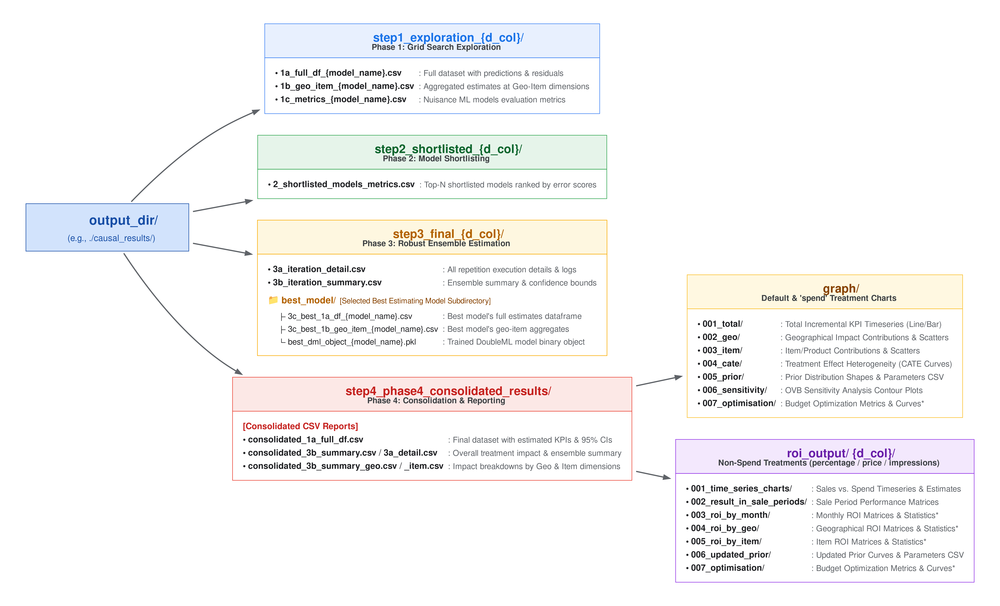

# DoubleML Pipeline

A robust Python library for automated causal inference utilizing Double Machine
Learning (DoubleML) and FLAML AutoML.

**By Google's APAC Marketing Effectiveness Taskforce**

*Note: `doubleml-pipeline` refers to and builds upon the underlying `DoubleML`
Python package published by [doubleml.org](https://docs.doubleml.org).*

--------------------------------------------------------------------------------

> [!IMPORTANT] **Caveat on File Generation:** For verification purposes,
> currently `doubleml_pipeline` generates CSV files and charts explicitly across
> the process.

## Why DoubleML Pipeline?

With **DoubleML Pipeline**, you can estimate the true incremental impact and ROI
of your marketing interventions including pricing and promotions by controlling
for complex, high-dimensional confounders.

Causal inference is challenging due to confounding bias, where standard
regression models often fail to isolate true causal relationships. Furthermore,
unlike standard supervised learning, Causal Machine Learning (CausalML) lacks
observational ground truth data for unobserved counterfactuals, making
**verifiability** a critical requirement for decision-making.

Double Machine Learning (DML) was selected as our base framework because it
solves these challenges through rigorous theoretical and statistical
guarantees—such as Neyman orthogonality and cross-fitting to eliminate
bias—allowing causal estimates to be mathematically verified and trusted.
**DoubleML Pipeline** operationalizes this framework by combining DML with
automated machine learning (AutoML) to make causal estimation both
scientifically robust and highly automated.

### Key Features:

*   **Automated Nuisance Modeling**: Automates nuisance parameter estimation
    using FLAML AutoML. It dynamically searches and tunes candidates (like
    LightGBM, XGBoost) under a specified time budget, removing the guesswork of
    model selection.
*   **Safe Business Unit Scaling**: Normalizes and scales geographical and
    population data securely, ensuring that descaled results represent accurate
    real-world business metrics (KPI, ROI) without introducing mathematical
    singularities.
*   **Treatment Effect Heterogeneity (CATE)**: Automatically fits continuous
    splines or binary bases to estimate how treatment effects vary across
    different contexts (Conditional Average Treatment Effects).
*   **Sensitivity Analysis (OVB)**: Runs robust omitted variable bias (OVB)
    checks to evaluate how sensitive your causal estimates are to unobserved
    confounders.
*   **Publication-Ready Visualizations**: Generates comprehensive time series
    line plots, stacked contribution bar charts, cross-sectional ROI
    comparisons, and prior distribution shapes.

--------------------------------------------------------------------------------

## Getting Started

### Prerequisites

Before running the pipeline, ensure you have:

*   **Python 3.9** or later.

### Installation

You can install the library directly from PyPI:

```bash
pip install doubleml-pipeline
```

Alternatively, to install from source:

```bash
git clone https://github.com/google/doubleml-pipeline.git
cd doubleml-pipeline
pip install .
```

### Quick Start Example

Here is how to initialize and run the causal pipeline in a standard Python
environment, explicitly configuring all scaling, modeling, and financial
parameters:

```python
import pandas as pd
# Note: Module name uses underscores (_) instead of hyphens (-)
from doubleml_pipeline.preprocessing.scalers import CausalDataScaler
from doubleml_pipeline.workflow import CausalWorkflowOrchestrator

# 1. Load your dataset
df = pd.read_csv("path/to/your/marketing_data.csv")

# 2. Initialize the scaler with explicit scaling strategies per column
scaler = CausalDataScaler(
    standardize_cols=["holiday_index", "seasonality_factor"],
    population_standardize_cols=["competitor_spend"],
    population_median_normalize_cols=["sales_revenue", "tv_spend"],
    min_max_cols=["store_count"],
    median_normalize_cols=["discount_rate"],
    population_col="geo_population",
)

# 3. Initialize the orchestrator with all explicit configuration parameters
orchestrator = CausalWorkflowOrchestrator(
    # Primary target and treatments (single treatment to support optimization)
    y_col="sales_revenue",
    d_cols=["discount_rate"],
    x_cols_list=[
        ["holiday_index", "seasonality_factor", "competitor_spend"],
    ],
    # Nuisance estimation models & cross-validation setup
    ml_models_y=["lgbm", "xgboost"],
    ml_models_t=["lgbm", "xgboost"],
    n_folds_list=[5],
    output_dir="./causal_results",
    n_jobs=-1,
    # Conditional Average Treatment Effect (CATE) specification
    covariates_for_cate_list=[
        ["seasonality_factor"],
    ],
    cate_structure_list=[
        {"type": "auto_additive", "df": 3, "degree": 2, "include_intercept": False},
    ],
    time_budget=30,
    # Panel data dimensions
    date_col="date",
    geo_col="geo",
    item_col="item",
    geo_name_col="geo_name",
    item_name_col="item_name",
    # Sensitivity analysis (Omitted Variable Bias)
    run_sensitivity=True,
    sensitivity_scope=["total", "geo", "item"],
    # Ground truth validation (set True if ground truth effect columns exist)
    ground_truth_existence=False,
    ground_truth_effect_column=None,
    # Treatment type classification & monetary spend mapping
    treatment_types={
        "discount_rate": "percentage",
    },
    treatment_spend_cols={
        "discount_rate": "discount_cost",
    },
    sales_col="sales_revenue",
)

# 4. Execute the full 4-phase pipeline (Grid Search -> Shortlist -> Ensemble -> Consolidation)
orchestrator.run_full_pipeline(
    df=df,
    scaler=scaler,
    top_n=3,
    n_reps=10,
)
```

The orchestrator will execute the models in parallel, select the best
estimators, run repetitions to calculate robust confidence bounds, perform
sensitivity checks, and write all dataframes and plot artifacts to the specified
`./causal_results` directory.

### Pipeline Execution Flow (4 Phases)

1.  **Grid Search Exploration**: Fits nuisance models for outcome `Y` and treatment `T` across all candidate AutoML models and fold combinations in parallel.
2.  **Shortlisting**: Ranks and selects top-performing models (`top_n`) based on combined error metrics.
3.  **Robust Ensemble Estimation**: Re-estimates shortlisted models across `n_reps` iterations to build a weighted ensemble with empirical confidence bounds (2.5%–97.5%).
4.  **Consolidation & Reporting**: Aggregates causal effects (CATE, incremental KPI, ROI), runs OVB sensitivity checks, and outputs charts.

### Output Directory Structure

When the pipeline runs, it saves all intermediate evaluation metrics, candidate
model repetitions, consolidated datasets, and visualization plots within the
specified `output_dir` (e.g., `./causal_results/`) as shown below:



### Important Notes on Outputs & Optimization

1.  **ROI Charts:** Specific ROI charts (`003_promo_roi_by_month` and
    `004_promo_roi_by_entity`) are conditionally generated depending on your
    configured `treatment_types` (default is `"spend"`), along with
    `treatment_spend_cols` and `sales_col`, as summarized below:

    | `treatment_types` | `treatment_spend_cols` & `sales_col` | ROI Charts | Pipeline Behavior & Reason |
    | :--- | :--- | :--- | :--- |
    | `"spend"` *(default)* | Not required | **Not Generated** | Not generated specifically because they are redundant with the output generated in Phase 4. |
    | `"percentage"`, `"impressions"`, or `"price"` | **Provided** | **Generated** | Explicitly generates ROI charts (`003_promo_roi_by_month` and `004_promo_roi_by_entity`). |
    | `"percentage"`, `"impressions"`, or `"price"` | **Missing** | **Skipped (Warning)** | Pipeline logs a warning and skips ROI charts because monetary spend mapping is missing. |

2.  **Optimization:** Currently, optimization calculations can only be performed
    if `optimize = True` and `simple_optimization = True` with a single
    treatment. Optimization is not calculated if `simple_optimization = False`
    because the optimization function is under development and optimization for
    multiple treatments is not supported yet.

### User Guide

For a comprehensive step-by-step walkthrough of pipeline settings, modeling workflows, and visual slide guides, refer to the [User Guide](docs/guide.md).

[](docs/guide.md)

--------------------------------------------------------------------------------

## Engaging with the Project

### Documentation & Examples

*   **User Guide**: For a step-by-step walkthrough of pipeline settings and visual slide guides, refer to the [User Guide](docs/guide.md).
*   **API Reference**: For a comprehensive list of modules, classes, and
    function signatures, refer to the [API Reference](docs/api_reference.md).
*   **Interactive Sample**: Check out the
    [Sample Jupyter Notebook](examples/doubleml-pipeline_sample_notebook_IN.ipynb) which walks
    through simulating realistic panel marketing data, engineering lagged
    features, scaling, running the DML pipeline, and plotting the results.

### Contributing & Feedback

We welcome contributions!

*   **Reporting Issues**: If you encounter bugs or want to request features,
    please open an issue in the GitHub repository issue tracker.
*   **Submitting Changes**: Please see [CONTRIBUTING.md](CONTRIBUTING.md) for our guidelines on
    submitting pull requests.

--------------------------------------------------------------------------------

## References

1.  **Debiased Machine Learning method** Victor Chernozhukov, Denis Chetverikov,
    Mert Demirer, Esther Duflo, Christian Hansen, Whitney Newey, James Robins.
    *Double/debiased machine learning for treatment and structural parameters*.
    [arXiv:1608.00060](https://arxiv.org/abs/1608.00060)

2.  **Hyperparameter Tuning for Causal Inference with Double Machine Learning: A
    Simulation Study** Martin Spindler, et al.
    [arXiv:2402.04674](https://arxiv.org/abs/2402.04674)

3.  **Debiased Machine Learning of Conditional Average Treatment Effects and
    Other Causal Functions** Vira Semenova, Victor Chernozhukov.
    [arXiv:1702.06240](https://arxiv.org/abs/1702.06240)

4.  **Multiway Cluster Robust Double/Debiased Machine Learning** Harold D.
    Chiang, Kengo Kato, Yukitoshi Matsushita, Takuya Ishihara.
    [arXiv:1909.03489](https://arxiv.org/abs/1909.03489)
